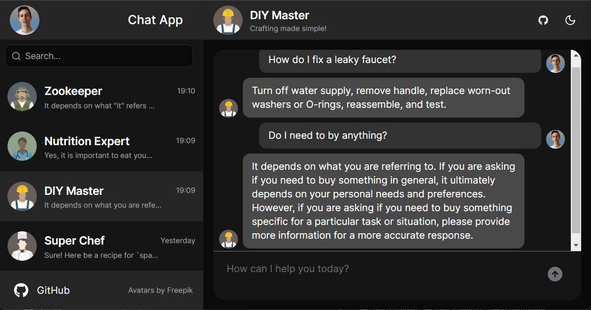

# AI Chat App - Chat with your assistants



This demo app is a chat app that allows you to chat with different assistants.

It uses [NLUX](https://docs.nlkit.com/nlux/) for the AIChat component and the communication with the LLM provider.

## Features

- Multiple assistants
- Persistence with local storage
- Conversations sorted by last message date

## Installing

Install the npm packages

```bash
npm install
# or
yarn
# or
pnpm install
```

## Getting Started

First, run the development server:

```bash
npm run dev
# or
yarn dev
# or
pnpm dev
```

Open [http://localhost:3000](http://localhost:3000) with your browser to see the result.
